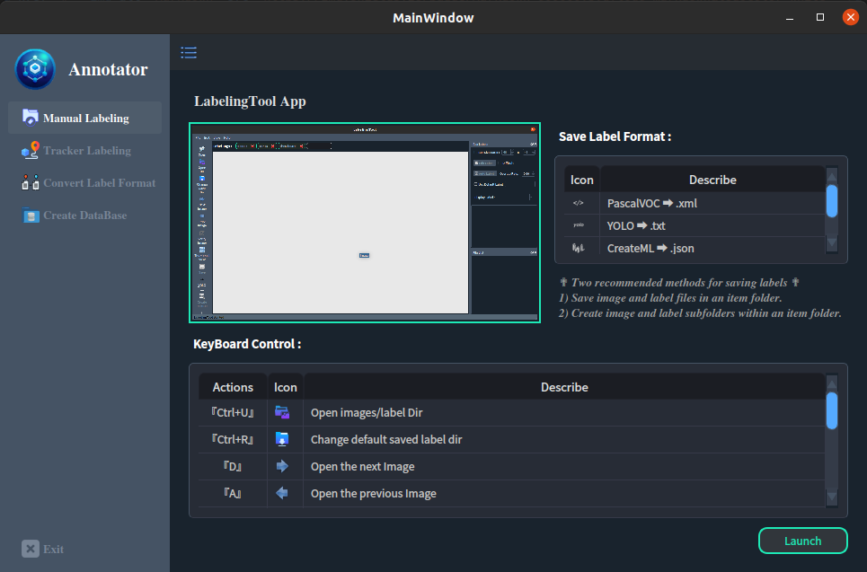
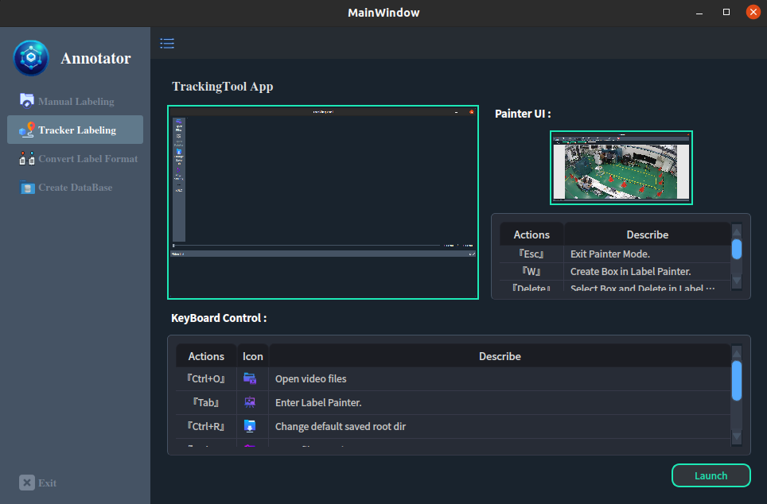
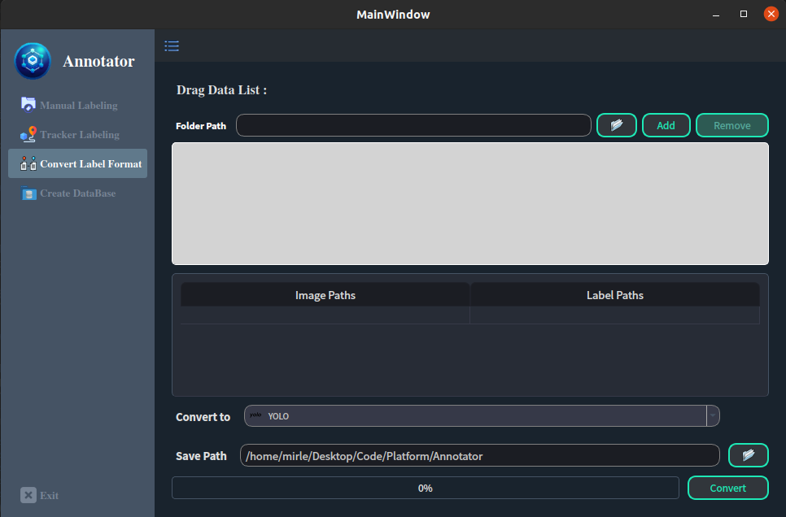
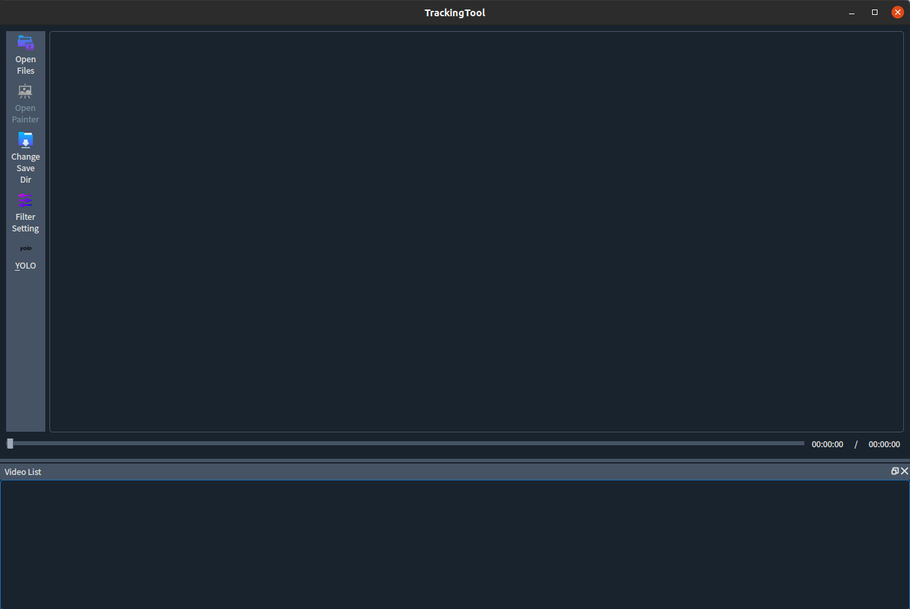
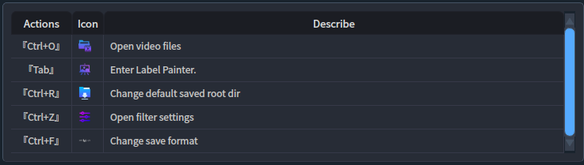
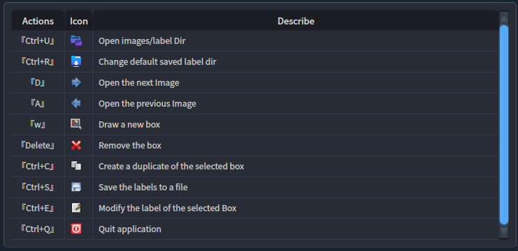

# Annotation Tool (v1.0.1)
<p>
    <a href="#"></a>
    <a href="#"></a>
    <a href="#"></a>
    <a href="#"></a>
    <a href="#"></a>
    <a href="#"></a>
</p>

<p class="center">
    
    
    
</p>

<h1 id="Dependecies">➤ Dependecies</h1>

Note: It is recommended to create a virtual environment under Anaconda for installation.


1) **Python 3.8+** 

2) **Install Python libraries requirements:**

    The `requirements.txt` file should list all Python libraries that your notebooks
    depend on, and they will be installed using:
    ```bash
    $ pip install -r requirements.txt
    ```

3) **Build Resource File:**

    This command utilizes the PyQt5 Resource Compiler (pyrcc5) tool. Its purpose is to compile a resource file (.qrc file) into Python code, allowing you to utilize these resources in your application, such as images, fonts, style sheets, etc.
    ```bash
    $ sudo pyrcc5 -o resources/resources.py resources/resources.qrc
    ```

<h1 id="Usage">➤ Usage</h1>

***Tracking Labeling Tool*** :

- Run :

    <p>
        
    </p>

    ```bash
    # methods 1: setting in the UI
    $ python trackingTool.py

    # methods 2: custom yourself
    $ python trackingTool.py -i <path-to-video-dir> -c <path-to-txt-classes> -o <path-to-ouput-dir>
    ```

    Description of CLI all arguments:
    - `--video_dir` : Path to the input video directory.

    - `--class_file` : Path to the file containing class names.

    - `--save_dir` : Folder to save the results(Default: Under the path of the current video)

- Keyboard operation:

    Tracker View

    <p>
        
    </p>

    Label Painter

    | ID       | Describe             |
    |----------|----------------------|
    | w        |Create Box.           |
    | Delete   |Select Box and Delete.|
    | Ctrl+C   |Copy the previous box.|
    | Esc      |Exit Painter Mode.    |


***Manual Labeling Tool*** :

- Run :

    <p>
        
    </p>

    ```bash
    # methods 1: setting in the UI
    $ python labelingTool.py

    # method 2: custom yourself
    $ python labelingTool.py -i <path-to-image-dir> -c <path-to-txt-classes> -o <path-to-label-dir>
    ```

    Description of CLI all arguments:

    - `--image_dir` : Path to the directory containing images.

    - `--class_file` : Path to the file containing class names.

    - `--save_dir` : Path to the directory to save labels.

- Keyboard operation:

    <p>
        
    </p>