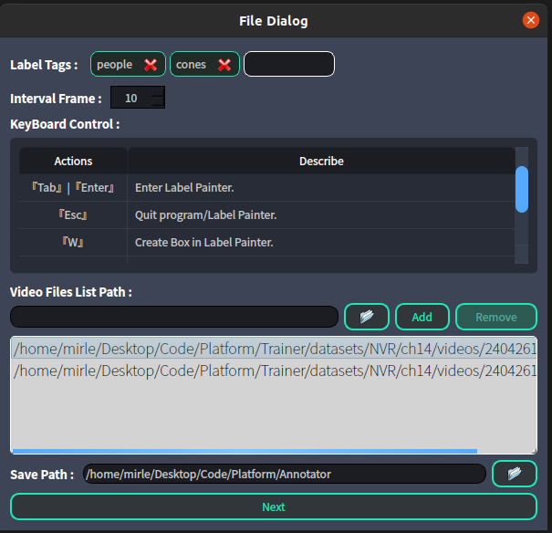
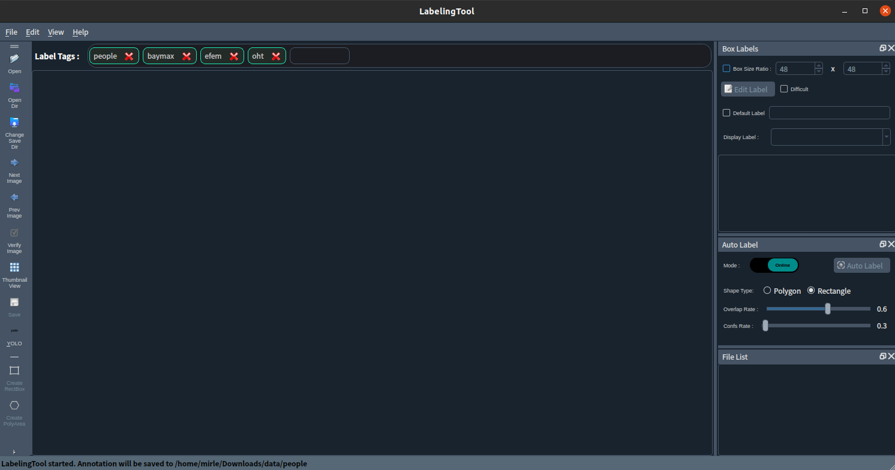

# Annotation Tool
<p>
    <a href="#"></a>
    <a href="#"></a>
    <a href="#"></a>
    <a href="#"></a>
    <a href="#"></a>
    <a href="#"></a>
</p>


<h1 id="Dependecies">➤ Dependecies</h1>

**Install Python libraries requirements:**

The `requirements.txt` file should list all Python libraries that your notebooks
depend on, and they will be installed using:
```bash
$ pip install -r requirements.txt
```

This command utilizes the PyQt5 Resource Compiler (pyrcc5) tool. Its purpose is to compile a resource file (.qrc file) into Python code, allowing you to utilize these resources in your application, such as images, fonts, style sheets, etc.
```bash
$ pyrcc5 -o modules/libs/resources.py modules/resources.qrc
```

<h1 id="Usage">➤ Usage</h1>

Note: 
<font color="yellow">Please check the labels in the 'default_classes.txt' file first.</font>. You don't need to specify the following CLI arguments.

* ***Tracking Labeling Tool*** :

    1) Run :
        ```bash
        # setting in the UI
        python trackingTool.py
        ```
        Drag and drop a video files into the [<font color="yellow">Video Files List Path</font>] field.
        <p>
            
        </p>

        ```bash
        # CLI
        python trackingTool.py -i <path-to-video-dir> -c <path-to-txt-classes> -o <path-to-ouput-folder>
        ```

        Description of CLI all arguments:
        - `--video_dir` : Path to the input video directory.

        - `--class_file` : Path to the file containing class names.

        - `--save_folder` : Folder to save the results.
    
    2) Keyboard operation:

        Note: if `Enter`下想修正相同目標跟框有些微偏移時, 只需在框新的框它會自動修正舊的偏移框
        | ID       | Describe           |
        |----------|--------------------|
        | Enter    |Create new bbox.    |
        | Delete   |Delete error bbox.  |
        | Esc      |Quit.               | 

* ***Manual Labeling Tool*** :
    ```bash
    # setting in the UI
    python labelingTool.py
    ```
    * [<font color="yellow">Open Directory</font>] corresponds to the 'images' folder
    
    * [<font color="yellow">Change Saving Directory</font>] corresponds to the 'labels' folder.
    <p>
        
    </p>

    ```bash
    # custom yourself
    python labelingTool.py -i <path-to-image-dir> -c <path-to-txt-classes> -o <path-to-label-folder>
    ```

    Description of CLI all arguments:
    - `--image_dir` : Path to the directory containing images.

    - `--class_file` : Path to the file containing class names.

    - `--save_dir` : Path to the directory to save labels.

